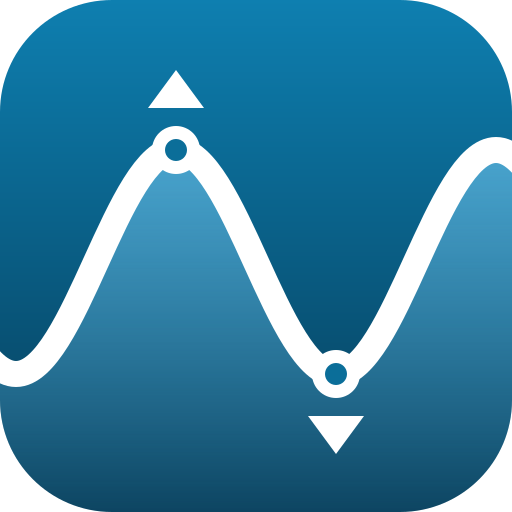

<p align="center">
  
</p>

<h1 align="center">Mare: Setup Guide · Guide d’installation</h1>

<p align="center"><b><a href="#english">English</a> · <a href="#français">Français</a></b></p>

## English

### 1. Install the integration

**With HACS:** HACS → ⋮ → *Custom repositories* → add this repository with the type **Integration** → install **Mare** → restart Home Assistant.

**Manually:** copy the `custom_components/mare_tides` folder into your Home Assistant configuration folder, then restart:

```text
config/
└── custom_components/
    └── mare_tides/
        ├── __init__.py
        ├── admiralty.py
        ├── api.py
        ├── config_flow.py
        ├── const.py
        ├── coordinator.py
        ├── dfo.py
        ├── kartverket.py
        ├── manifest.json
        ├── marine_institute.py
        ├── noaa.py
        ├── providers.py
        ├── rijkswaterstaat.py
        ├── sensor.py
        ├── strings.json
        └── translations/
            ├── en.json
            └── fr.json
```

### 2. Add a tide station

1. *Settings → Devices & services → Add integration* → search for **Mare**.
2. Pick the source: **Canada** (Fisheries and Oceans Canada, DFO), **United States** (NOAA), **United Kingdom** (ADMIRALTY, needs a free API key), **Norway** (Kartverket), **Netherlands** (Rijkswaterstaat) or **Ireland** (Marine Institute). It defaults to your Home Assistant country.
   - **United Kingdom only:** paste your ADMIRALTY API key. Get it at the [ADMIRALTY developer portal](https://admiraltyapi.portal.azure-api.net/) by subscribing to *UK Tidal API - Discovery* (free). When the key expires, Home Assistant shows a *Reconfigure* notice under *Settings → Devices & services* asking for a new one.
3. The map starts at your home location. Keep it, or move the pin to look for stations somewhere else, then submit.
4. Pick one of the **5 nearest stations** (each shows its code and distance), or tick *Search all stations instead* and type part of a name or code.

Repeat to add more stations.

For NOAA *subordinate* stations, NOAA only publishes high and low tides; Mare draws the curve between them (`interpolated: true`).

**Sensors created** (entity IDs follow your Home Assistant language when the station is added):

| Sensor | State | Useful attributes |
|---|---|---|
| Tide level | Predicted level now, in metres | `trend`, `tide_data`, `tide_extremes`, `station_name`, `provider`, `datum`, `interpolated` |
| Next high tide | Time of the next high tide | `height` |
| Next low tide | Time of the next low tide | `height` |

### 3. Change the station or the refresh rate

*Settings → Devices & services → Mare → Configure*

- **Recalculate the current level every**: how often the current level updates (default 5 minutes). Predictions themselves are downloaded once an hour.
- **Change station**: runs the same source → map → nearest stations → search steps. Your entity IDs stay the same, so cards and automations keep working.

### 4. Install the card

See [Mare Tide Card](https://github.com/olivierouellet/Mare-Tide-Card): install it with HACS (type **Dashboard**) or copy `mare-tide-card.js` to `config/www/` and add it as a resource. Then add **Mare Tide Card** from the card picker and choose:

- **Home Assistant sensor (Mare integration)**: pick the *tide level* sensor, or
- **Directly from DFO (no integration, Canadian stations only)**: pick a station from the list (nearest to home, or use *Use my current position*, or search).

Example:

```yaml
type: custom:mare-tide-card
entity: sensor.halifax_tide_level
span: rolling
hours: 48
```

### Troubleshooting

- **Logs:** *Settings → System → Logs*, search for `mare_tides`.
- **“Could not reach the tide prediction service”:** check that Home Assistant can reach the service for your country: `api-iwls.dfo-mpo.gc.ca` (Canada), `api.tidesandcurrents.noaa.gov` (United States), `admiraltyapi.azure-api.net` (United Kingdom), `vannstand.kartverket.no` (Norway), `ddapi20-waterwebservices.rijkswaterstaat.nl` (Netherlands) or `erddap.marine.ie` (Ireland).
- **The card says the sensor has no tide data:** pick the *tide level* sensor, not *next high/low tide*.
- **Direct mode shows “Could not load tides from DFO”:** the browser must be able to reach `api-iwls.dfo-mpo.gc.ca` (some ad blockers or firewalls block it).
- **“Use my current position” isn’t available:** browsers only allow it over HTTPS or in the Home Assistant app.
- **Test the APIs yourself:**
  - DFO: `https://api-iwls.dfo-mpo.gc.ca/api/v1/stations/5cebf1df3d0f4a073c4bbcbb/data?time-series-code=wlp-hilo&from=2026-09-27T00:00:00Z&to=2026-09-28T00:00:00Z`
  - NOAA: `https://api.tidesandcurrents.noaa.gov/api/prod/datagetter?product=predictions&station=8443970&begin_date=20260927&end_date=20260928&datum=MLLW&time_zone=gmt&units=metric&interval=hilo&format=json`

---

## Français

### 1. Installer l’intégration

**Avec HACS :** HACS → ⋮ → *Dépôts personnalisés* → ajoutez ce dépôt avec le type **Intégration** → installez **Mare** → redémarrez Home Assistant.

**Manuellement :** copiez le dossier `custom_components/mare_tides` dans le dossier de configuration de Home Assistant, puis redémarrez (voir l’arborescence dans la section anglaise ci-dessus).

### 2. Ajouter une station de marée

1. *Paramètres → Appareils et services → Ajouter une intégration* → cherchez **Mare**.
2. Choisissez la source : **Canada** (Pêches et Océans Canada, MPO), **États-Unis** (NOAA), **Royaume-Uni** (ADMIRALTY, clé d’API gratuite requise), **Norvège** (Kartverket), **Pays-Bas** (Rijkswaterstaat) ou **Irlande** (Marine Institute). Par défaut, c’est le pays configuré dans Home Assistant.
   - **Royaume-Uni seulement :** collez votre clé d’API ADMIRALTY. Obtenez-la sur le [portail des développeurs ADMIRALTY](https://admiraltyapi.portal.azure-api.net/) en vous abonnant à *UK Tidal API - Discovery* (gratuit). Quand la clé expire, Home Assistant affiche un avis *Reconfigurer* dans *Paramètres → Appareils et services* pour en demander une nouvelle.
3. La carte s’ouvre sur l’emplacement de votre domicile. Gardez-le, ou déplacez l’épingle pour chercher des stations ailleurs, puis soumettez.
4. Choisissez l’une des **5 stations les plus proches** (chacune affiche son code et sa distance), ou cochez *Rechercher parmi toutes les stations* et tapez une partie d’un nom ou d’un code.

Recommencez pour ajouter d’autres stations.

Pour les stations *secondaires* de la NOAA, seules les marées hautes et basses sont publiées; Mare trace la courbe entre elles (`interpolated: true`).

**Capteurs créés** (les identifiants d’entité suivent la langue de Home Assistant au moment de l’ajout) :

| Capteur | État | Attributs utiles |
|---|---|---|
| Niveau de marée | Niveau prédit en ce moment, en mètres | `trend`, `tide_data`, `tide_extremes`, `station_name`, `provider`, `datum`, `interpolated` |
| Prochaine marée haute | Heure de la prochaine marée haute | `height` (hauteur) |
| Prochaine marée basse | Heure de la prochaine marée basse | `height` (hauteur) |

### 3. Changer de station ou la fréquence de mise à jour

*Paramètres → Appareils et services → Mare → Configurer*

- **Recalculer le niveau actuel toutes les** : fréquence de mise à jour du niveau actuel (5 minutes par défaut). Les prédictions sont téléchargées une fois par heure.
- **Changer de station** : reprend les étapes source → carte → stations les plus proches → recherche. Vos identifiants d’entité ne changent pas : vos cartes et automatisations continuent de fonctionner.

### 4. Installer la carte

Voir [Mare Tide Card](https://github.com/olivierouellet/Mare-Tide-Card#français) : installez-la avec HACS (type **Dashboard**) ou copiez `mare-tide-card.js` dans `config/www/` et ajoutez-la comme ressource. Ajoutez ensuite **Mare Tide Card** depuis le sélecteur de cartes et choisissez :

- **Capteur Home Assistant (intégration Mare)** : choisissez le capteur de *niveau de marée*, ou
- **Directement de MPO (sans intégration, stations canadiennes seulement)** : choisissez une station dans la liste (les plus proches du domicile, *Utiliser ma position actuelle*, ou la recherche).

Exemple :

```yaml
type: custom:mare-tide-card
entity: sensor.halifax_niveau_de_maree
span: rolling
hours: 48
language: fr
```

### Dépannage

- **Journaux :** *Paramètres → Système → Journaux*, cherchez `mare_tides`.
- **« Impossible de joindre le service de prédictions de marée » :** vérifiez que Home Assistant peut joindre le service de votre pays : `api-iwls.dfo-mpo.gc.ca` (Canada), `api.tidesandcurrents.noaa.gov` (États-Unis), `admiraltyapi.azure-api.net` (Royaume-Uni), `vannstand.kartverket.no` (Norvège), `ddapi20-waterwebservices.rijkswaterstaat.nl` (Pays-Bas) ou `erddap.marine.ie` (Irlande).
- **La carte indique que le capteur n’a pas de données de marée :** choisissez le capteur de *niveau de marée*, pas celui de la prochaine marée haute ou basse.
- **Le mode direct affiche « Impossible de charger les marées de MPO » :** le navigateur doit pouvoir joindre `api-iwls.dfo-mpo.gc.ca` (certains bloqueurs de publicité ou pare-feu le bloquent).
- **« Utiliser ma position actuelle » n’est pas disponible :** les navigateurs ne le permettent qu’en HTTPS ou dans l’application Home Assistant.
